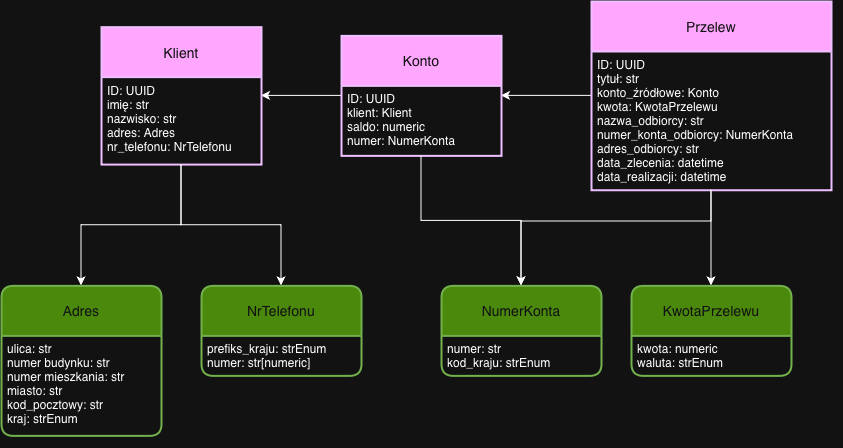
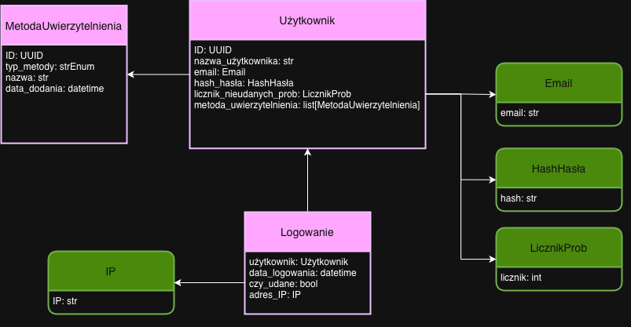

# TBO - lab 1

## Wstęp (Opis Zadania)
Celem zadania jest zamodelowanie wybranego fragmentu bezpiecznej aplikacji bankowej zgodnie z zasadami
Domain-Driven Design (DDD). Projekt skupia się na podstawowej, ale krytycznej operacji, jaką jest realizacja
przelewu krajowego. Poniższy model przedstawia kluczowe byty, agregaty oraz obiekty wartości biorące udział
w tym procesie, wraz z definicją ich granic (Bounded Context) i fundamentalnych założeń bezpieczeństwa.

## Model Domeny

### Zidentyfikowane Konteksty Ograniczone (Bounded Contexts)

Dla wybranego fragmentu systemu bankowego zidentyfikowano dwa główne konteksty:

* Transakcje
  * Proces inicjowania, walidacji i wykonywania przelewów pieniężnych.
  * Zarządzanie operacją przelewu, który komunikuje się z kontem w celu obciążenia rachunku nadawcy.

## Model agregatów i danych

### Transakcje

#### Klient
- **ID**
  - typ: `UUID`
  - wymagane: tak
- **imię**
  - typ: `str`
  - wymagane: tak
  - długość: 2–50 znaków
  - format: tylko litery (A–Z, a–z, łącznie z polskimi znakami)
- **nazwisko**
  - typ: `str`
  - wymagane: tak
  - długość: 2–50 znaków
  - format: tylko litery (A–Z, a–z, łącznie z polskimi znakami)
- **adres**
  - typ: `Adres`
  - wymagane: tak
- **nr_telefonu**
  - typ: `NrTelefonu`
  - wymagane: tak

---

#### Konto
- **ID**
  - typ: `UUID`
  - wymagane: tak
- **klient**
  - typ: `Klient`
  - wymagane: tak
- **saldo**
  - typ: `numeric`
  - wymagane: tak
  - minimalna wartość: 0.00
  - precyzja: 2 miejsca po przecinku
- **numer**
  - typ: `NumerKonta`
  - wymagane: tak

---

#### Przelew
- **ID**
  - typ: `UUID`
  - wymagane: tak
- **tytuł**
  - typ: `str`
  - wymagane: tak
  - długość: 3–140 znaków
- **konto_źródłowe**
  - typ: `Konto`
  - wymagane: tak
- **kwota**
  - typ: `KwotaPrzelewu`
  - wymagane: tak
- **nazwa_odbiorcy**
  - typ: `str`
  - wymagane: tak
  - długość: 2–100 znaków
- **numer_konta_odbiorcy**
  - typ: `NumerKonta`
  - wymagane: tak
- **adres_odbiorcy**
  - typ: `str` (intencjonalnie `str`, a nie `Adres` - w typowych systemach bankowych jest to mało istotne i wpisywane ręcznie)
  - wymagane: nie
  - maks. długość: 200 znaków
- **data_zlecenia**
  - typ: `datetime`
  - wymagane: tak
- **data_realizacji**
  - typ: `datetime`
  - wymagane: nie
  - warunek: >= `data_zlecenia`

---

#### Adres
- **ulica**
  - typ: `str`
  - wymagane: tak
  - maks. długość: 100 znaków
- **numer_budynku**
  - typ: `str`
  - wymagane: tak
  - maks. długość: 10 znaków
- **numer_mieszkania**
  - typ: `str`
  - wymagane: nie
  - maks. długość: 10 znaków
- **miasto**
  - typ: `str`
  - wymagane: tak
  - maks. długość: 50 znaków
- **kod_pocztowy**
  - typ: `str`
  - wymagane: tak
  - format: np. `NN-NNN` - zależny od kraju
- **kraj**
  - typ: `strEnum`
  - wymagane: tak
  - maks. długość: 50 znaków
  - wybierany z odgórnie zdefiniowanej listy krajów

---

#### NrTelefonu
- **prefiks_kraju**
  - typ: `strEnum`
  - wymagane: tak
  - format: `+NN` lub `+NNN`
  - walidowany z predefiniowaną listą prefiksów dla wszystkich krajów
- **numer**
  - typ: `str[numeric]`
  - wymagane: tak
  - długość: 6–12 cyfr

---

#### NumerKonta
- **numer**
  - typ: `str`
  - wymagane: tak
  - długość: 20–34 znaki
  - format: IBAN (opcjonalnie z odstępami)
- **kod_kraju**
  - typ: `strEnum`
  - wymagane: tak
  - wybierany z odgórnie zdefiniowanej listy prefiksów krajów

---

#### KwotaPrzelewu
- **kwota**
  - typ: `numeric`
  - wymagane: tak
  - minimalna wartość: 0.01
  - precyzja: 2 miejsca po przecinku
- **waluta**
  - typ: `strEnum`
  - wymagane: tak
  - wybierana z odgórnie zdefiniowanej listy walut

### Uwierzytelnianie do konta

#### Użytkownik
- **ID**
  - typ: `UUID`
  - wymagane: tak
- **nazwa_użytkownika**
  - typ: `str`
  - wymagane: tak
  - długość: 3–40 znaków
  - format: litery, cyfry, podkreślenia; bez spacji
- **email**
  - typ: `Email`
  - wymagane: tak
- **hash_hasła**
  - typ: `HashHasła`
  - wymagane: tak
- **licznik_nieudanych_prob**
  - typ: `LicznikProb`
  - wymagane: tak
- **metoda_uwierzytelnienia**
  - typ: `list[MetodaUwierzytelnienia]`
  - wymagane: tak
  - co najmniej 1 metoda przypisana do użytkownika

---

#### MetodaUwierzytelnienia
- **ID**
  - typ: `UUID`
  - wymagane: tak
- **typ_metody**
  - typ: `strEnum`
  - wymagane: tak
  - dozwolone wartości: `[hasło, passkey, klucz sprzętowy, e-mail, biometria]`
- **nazwa**
  - typ: `str`
  - wymagane: tak
  - długość: 3–50 znaków
- **data_dodania**
  - typ: `datetime`
  - wymagane: tak

---

#### Logowanie
- **użytkownik**
  - typ: `Użytkownik`
  - wymagane: tak
- **data_logowania**
  - typ: `datetime`
  - wymagane: tak
- **czy_udane**
  - typ: `bool`
  - wymagane: tak
  - opis: `true` = logowanie poprawne, `false` = błędne hasło lub metoda
- **adres_IP**
  - typ: `IP`
  - wymagane: tak

---

#### Email
- **email**
  - typ: `str`
  - wymagane: tak
  - maks. długość: 100 znaków
  - format: poprawny adres e-mail `user@host.domain`

---

#### HashHasła
- **hash**
  - typ: `str`
  - wymagane: tak
  - długość: 60–255 znaków

---

#### LicznikProb
- **licznik**
  - typ: `int`
  - wymagane: tak
  - minimalna wartość: 0
  - maksymalna wartość: 10
  - resetowany po udanym logowaniu

---

#### IP
- **IP**
  - typ: `str`
  - wymagane: tak
  - format: IPv4 lub IPv6
    - przykłady: `192.168.0.1`, `2001:0db8:85a3::8a2e:0370:7334`

## Założenia

